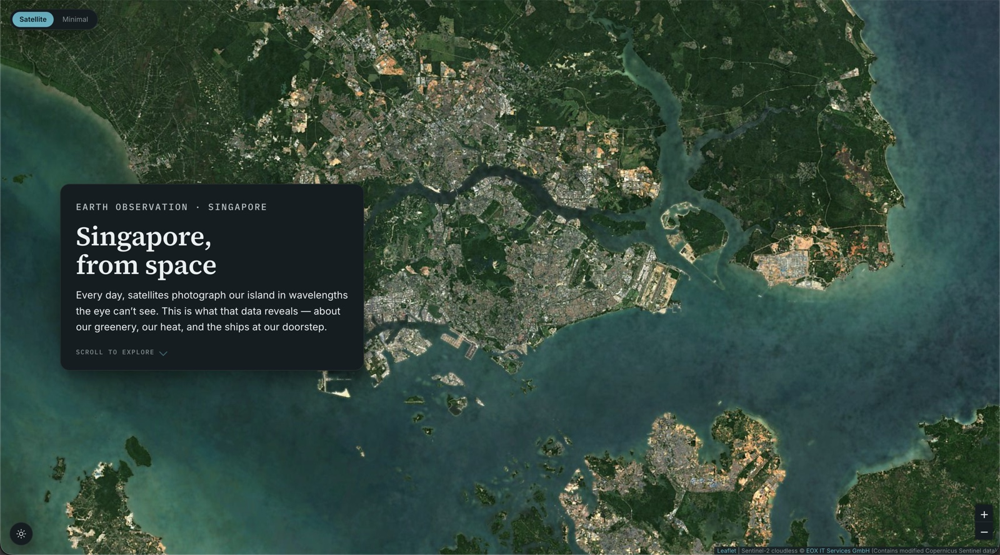

# Singapore from Space — Earth Observation, made visible

[](https://radc4t.github.io/earth-observation-sg/)
[](https://github.com/radc4t/earth-observation-sg/actions/workflows/ci.yml)
[](LICENSE)
[](#run-it-locally-no-build-step)

[](https://radc4t.github.io/earth-observation-sg/)

A scrolling data story that shows citizens what Singapore looks like from Earth‑observation
satellites, and explains what the data reveals: **green cover** (vegetation index), **urban heat**
(land‑surface temperature), and **maritime traffic** in the Singapore Strait. It’s built around a
real, pannable satellite map that flies between locations as you scroll — an editorial "field
report", not a dashboard.

### ▶ **[View the live story →](https://radc4t.github.io/earth-observation-sg/)**

> Public‑communication prototype for an Earth Observation Initiative. _"We observe the Earth from
> space"_ means little on its own — _"here is what Singapore looks like from space, and here is what
> the data tells you about your environment"_ is immediate.

## What it shows

Four scroll chapters over one live map:

| Chapter        | Layer                         | What you’re looking at                                                              |
| -------------- | ----------------------------- | ----------------------------------------------------------------------------------- |
| **Vegetation** | NDVI                          | Living green cover — dense canopy over the Central Catchment down to bare worksites |
| **Urban heat** | Land‑surface temperature (°C) | Where the ground runs hottest — industrial Jurong/Tuas vs. the cool forested centre |
| **Maritime**   | Vessel traffic                | The shipping lanes of the Strait — container ships, tankers, bulk carriers          |
| **Methods**    | —                             | Plain field‑notes on how each picture was made, with full provenance                |

Click (or press <kbd>Enter</kbd>) anywhere on an active data layer to read the **actual value** under
that point — an NDVI reading and vegetation class, or the temperature in °C.


<sub>The **Urban heat** chapter — real Landsat 9 surface temperature (6 Jul 2025) over the live Sentinel‑2 basemap; water, cloud and shadow masked.</sub>

## Real vs. illustrative — read this first

Honesty about what is real is a core value of the project. The interface says it plainly in each
layer’s provenance line; here it is in full:

- **Real basemap.** The satellite basemap is genuine, free, no‑API‑key public imagery — the default
  **Satellite** ground is [EOX Sentinel‑2 cloudless](https://s2maps.eu) (Copernicus Sentinel‑2), with
  a neutral **Minimal** alternative from [Esri’s Light Gray Canvas](https://www.esri.com). Toggle,
  pan and zoom freely.
- **Real NDVI.** The vegetation layer is genuine **Sentinel‑2 NDVI** (28 Jul 2024, clouds & water
  masked), computed from the free AWS Open Data Sentinel‑2 L2A mirror by
  [`build_real_ndvi.py`](scripts/generate-placeholders/build_real_ndvi.py). Source bands are **10 m**;
  the exported overlay is that source resampled to **~16 m/px** for display — it is _not_ a 10 m
  raster (a single full‑res PNG would be far too large; a COG/XYZ tile pipeline is the path to true
  full‑res, noted below).
- **Real surface temperature.** The thermal layer is genuine **Landsat 9** Collection‑2 land‑surface
  temperature in real **°C** (6 Jul 2025; cloud, shadow & water masked via QA_PIXEL + QA_RADSAT,
  masked _before_ resampling so cloud edges don’t bleed), from the keyless Microsoft Planetary
  Computer archive via [`build_real_thermal.py`](scripts/generate-placeholders/build_real_thermal.py).
  Landsat’s thermal band is 100 m (USGS‑resampled to 30 m), displayed at ~32 m/px.
- **One illustration remains.** The vessel layer shows **simulated** tracks — labelled "Simulated
  tracks — not live AIS" in its legend and Methods notes — **not** live AIS. It’s wired to accept a
  real AIS feed via a one‑line swap; see [`docs/swap-instructions.md`](docs/swap-instructions.md).

This separation keeps the prototype truthful while the storytelling is proven, and shows exactly
where real rasters / AIS drop in.

## Design & motion — the "Field Report" system

The look is a deliberate editorial identity, not a default map UI:

- **Type.** Three self‑hosted faces (all SIL OFL): **Source Serif 4** (display), **Inter** (body/UI),
  **IBM Plex Mono** (data & coordinates). Bundled as hashed `woff2` — no webfont CDN.
- **Design tokens.** One semantic token system — colour (`--paper`, `--panel`, `--ink`, `--accent`),
  spacing and radius scales, and a small **motion vocabulary** — defined once and themed for
  **light (primary) and dark** (`prefers-color-scheme`, with a manual toggle that persists and wins
  over the OS).
- **Solid, legible panels.** Editorial story cards with a coordinate stamp, date, and a snapshot note;
  a legend with a colour ramp, ticks and a calm provenance line; a click‑to‑read **inspector** with a
  crosshair reticle. No translucent "glass".
- **Native motion, not a library.** The scroll engine stays native (IntersectionObserver + Leaflet
  `flyTo`); a small **transition coordinator** in `scrolly.js` gives each hand‑off a rhythm —
  _camera glides → the data develops in on the tail of the glide → chrome settles → the card arrives
  last._ Vegetation↔Heat cross‑fades in place (a legend "ramp morph"); the maritime layer **travels in
  with the camera**. Timings live in one place (`js/motion.js`, mirrored as CSS tokens). No Lenis, no
  GSAP, no new dependency.
- **Icons.** A tiny inline [Lucide](https://lucide.dev) set (theme, explore, disclosure, close,
  external, crosshair) — actions get icons; meaning stays in words.

## Accessibility

- **Reduced motion is a first‑class path.** With `prefers-reduced-motion: reduce`, every camera
  glide, fade, legend morph, card reveal and vessel drift is instant/static — nothing animates.
- **Keyboard & AT.** Skip‑link to the story; the map is focusable and reads its value on <kbd>Enter</kbd>
  / <kbd>R</kbd> with an `aria-live` announcement; visible focus rings; `aria-pressed` /
  `aria-expanded` on the controls; one `h1` and per‑chapter `h2`s.
- **Colour.** Colourblind‑safe ramps (viridis / inferno, no red‑green); AA‑checked text; a
  `forced-colors` (high‑contrast) pass and a print stylesheet.
- **Mobile.** A bottom‑sheet story over a fixed map, an "Explore map" peek, and a bottom‑sheet reading
  — a tap reads a value, a drag scrolls the story.

## Run it locally (no build step)

```bash
git clone https://github.com/radc4t/earth-observation-sg.git
cd earth-observation-sg
python3 -m http.server 8000
# open http://localhost:8000
```

Development stays **build‑free** — vanilla ES modules + [Leaflet](https://leafletjs.com) from a CDN
(needs internet for map tiles). The optimized bundle below is only for deployment.

> **Editing JS/CSS and not seeing changes?** A plain `http.server` sends no cache headers, so the
> browser caches the ES modules aggressively and a reload can keep running stale code. Use the
> no‑cache dev server **and** open it from the `127.0.0.1` origin (a distinct origin from
> `localhost`, so it never reuses a cached module map):
>
> ```bash
> python3 scripts/nocache_server.py   # serves . on 127.0.0.1:8000 with Cache-Control: no-store
> # open http://127.0.0.1:8000
> ```

## Tooling — lint / format / build / deploy

Optional dev tooling lives behind `npm` (Node 18+) and Python `ruff`; the app itself never requires a
build to run.

```bash
npm install            # devDeps + installs the Husky pre-commit hook
npm run lint           # ESLint (vanilla ES modules)
npm run format         # Prettier (js/css/html/md); `format:check` runs in CI
npm run build          # esbuild → dist/ (bundle.js, style.min.css, index.html, assets/)
npm run preview        # build, then serve dist/ locally
npm test               # unit + scientific tests (node --test, zero framework)
ruff check scripts/ && ruff format scripts/   # Python asset scripts (pip install ruff)
```

- **CI** — [`ci.yml`](.github/workflows/ci.yml): on every push/PR, ESLint + Prettier check +
  `npm run build` + **`npm test`** (JS), and Ruff check/format + the `ramps.py` self-test (Python).
  The test suite includes a **scientific check** that samples the real overlay PNGs at pinned
  coordinates and asserts the documented NDVI / °C value bands — so a data or ramp regression fails CI.
- **Deploy** — [`pages.yml`](.github/workflows/pages.yml): on push to `main`, builds `dist/` and
  publishes to **GitHub Pages** (live). _For a fresh fork this needs the one‑time repo setting
  Settings → Pages → Source → **GitHub Actions**._
- **Pre‑commit** (Husky + lint‑staged): ESLint/Prettier over staged files (and Ruff on `*.py`, if
  installed).

The Leaflet `L` global is intentional: it’s a CDN classic `<script>` loaded before the deferred
module bundle, so esbuild leaves the bare `L` as a runtime `window.L` reference.

> **Why Leaflet, not a WebGL map?** Leaflet renders raster tiles as plain `` — no web worker, no
> WebGL context, no tile‑CORS requirement — so it’s robust in every browser and embedded preview. For
> satellite imagery a flat, top‑down view also reads more truthfully than a tilted 3D one. The swap
> hooks and story structure are engine‑agnostic.

## Regenerating the data overlays

Placeholder overlays need `numpy` + `Pillow`; the **real** rasters also need `rasterio`:

```bash
pip install rasterio numpy pillow
python3 scripts/generate-placeholders/build_real_ndvi.py      # real Sentinel-2 NDVI
python3 scripts/generate-placeholders/build_real_thermal.py   # real Landsat surface temp
```

## Project structure

```
index.html                 hero + scroll chapters (incl. Methods) + map + legend + inspector
css/style.css              Field Report design system: tokens, light/dark, cards, legend,
                           motion, responsive/mobile, reduced-motion, print, forced-colors
js/
  app.js                   entry point (wires map/story/overlays/inspect/theme/mobile) — bundle entry
  config.js                SECTIONS — the story: camera, overlay, legend, copy per chapter
  map.js                   Leaflet init, basemap panes + cross-fade toggle, overlay registration
  scrolly.js               IntersectionObserver → flyTo + the transition coordinator (choreography)
  motion.js                motion tokens (durations/easings) — single source, mirrored in CSS
  state.js                 tiny central store (section, basemap, overlays, reduced-motion)
  theme.js                 light/dark manual override on top of prefers-color-scheme (persisted)
  mobile.js                bottom-sheet "Explore map" behaviour (sole owner of the mobile state)
  icons.js                 inline Lucide SVG set (decorative; controls carry the accessible name)
  metadata.js              LAYER_META — single provenance source; builds the Methods chapter
  ramps.js                 viridis/inferno stops — single source (JS + Python both read it)
  sample.js                canvas pixel sampler + LUT reverse-lookup (for the inspector)
  inspect.js               click / Enter → read the NDVI value or °C at a point (desktop + mobile)
  layers/
    ndvi.js                vegetation image overlay + inspect() + swapWithRealRaster()
    thermal.js             thermal image overlay + inspect() + swapWithRealRaster()
    maritime.js            animated vessels + rAF loop + replaceWithRealAIS()
assets/fonts/              self-hosted woff2 (Source Serif 4, Inter, IBM Plex Mono — SIL OFL)
assets/overlays/           ndvi_real.png + thermal_real.png (real); ndvi.png/thermal.png (placeholders)
test/                      node --test suite: pure logic + real-PNG scientific + CSS↔JS motion sync
scripts/build.mjs          esbuild production build → dist/
scripts/generate-placeholders/
  ramps.py                 loads the colour ramps from js/ramps.js (single source)
  generate_overlays.py     reproducible placeholder generator
  build_real_ndvi.py       real Sentinel-2 NDVI pipeline (AWS STAC + rasterio)
  build_real_thermal.py    real Landsat surface temp (Planetary Computer + rasterio)
docs/swap-instructions.md  per-layer real-data swap guide
.github/workflows/         ci.yml + pages.yml
```

## Single source of truth

The viridis (NDVI) and inferno (thermal) ramp stops live in one file, **`js/ramps.js`**. `config.js`
imports it for the legend gradients, the inspector reverse‑looks‑up against it, and the Python
builders parse it via `ramps.py` — so overlays, legends and click‑readouts can’t drift. Likewise, all
provenance (source, date, resolution) lives once in **`js/metadata.js`**, and every motion timing
lives once in **`js/motion.js`**. Nothing is kept in sync by hand.

## Possible extensions (the architecture already supports them)

- **Change over decades** — a fifth `SECTIONS` chapter + layer module over the Landsat archive
  (1980s→now) to show land reclamation, Changi’s expansion and new HDB estates appearing. The
  highest‑value next step for a portfolio piece.
- **Real rasters + live AIS** — via the swap hooks in [`docs/swap-instructions.md`](docs/swap-instructions.md).
- **True full‑resolution rasters** — a COG / XYZ tile pipeline instead of a single resampled PNG.

## Credits & data

- **Imagery & basemaps:** Sentinel‑2 cloudless © [EOX IT Services GmbH](https://s2maps.eu) (contains
  modified Copernicus Sentinel data); Esri Light Gray Canvas — Tiles © Esri, HERE, Garmin,
  © OpenStreetMap contributors, and the GIS user community.
- **Data:** Copernicus **Sentinel‑2** (ESA) via the AWS Open Data mirror; **Landsat 9** (USGS/NASA)
  via the Microsoft Planetary Computer.
- **Type:** Source Serif 4, Inter, IBM Plex Mono — all SIL Open Font License. **Icons:** Lucide (ISC).
  **Map rendering:** Leaflet.

## License

[MIT](LICENSE) © radc4t. The bundled fonts are under the SIL Open Font License; Leaflet is
BSD‑2‑Clause; Lucide icons are ISC. Satellite imagery and data are © their respective providers (see
Credits) and subject to their terms.
